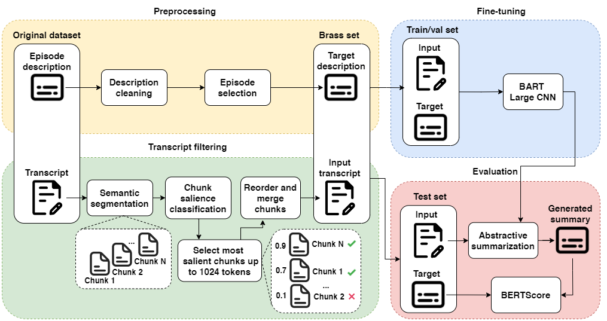

# 🎙️ Abstractive Podcast Summarization 📄

This repository contains a final project realized for the *Natural Language Processing* course of the [Master's degree in Artificial Intelligence](https://corsi.unibo.it/2cycle/artificial-intelligence), University of Bologna.

## Description

This project aims at producing a good abstractive summary of podcasts transcripts, obtained from the [Spotify Podcast Dataset](https://podcastsdataset.byspotify.com/). 
This task was originally proposed in the context of the [TREC Podcast Track 2020](https://trecpodcasts.github.io/participant-instructions-2020.html), where the objective was to provide a short text summary that a user might read when deciding whether to listen to a podcast. The summary should accurately convey the content of the podcast, be human-readable, and be short enough to be quickly read on a smartphone screen.

## Dataset
The [Spotify Podcast Dataset](https://arxiv.org/abs/2004.04270) is the first large-scale set of podcasts with transcripts that has been released publicly, with over 100,000 transcribed podcast episodes comprised of raw audio files, their transcripts and metadata. The transcription is provided by Google Cloud Platform’s Speech-to-Text API.

While no ground truth summaries are provided in the dataset, the episode descriptions written by the podcast creators serve as proxies for summaries, and are used for training supervised models.

More info about how to have access to the dataset on [podcasts-no-audio-13GB folder](./podcasts-no-audio-13GB/README.md).

## Solution proposed
In our solution an extractive module is developed to select salient chunks from the transcript, which serve as the input to an abstractive summarizer. The latter utilizes a BART model, that employs an encoder-decoder architecture.
An extensive pre-processing on the creator-provided descriptions is performed selecting a subset of the corpus that is suitable for the training supervised model.
The figure below summarizes the steps involved by our method.
In order to have a better understanding of our proposed solution, take a look to the [notebook](abstractive_podcast_summarization.ipynb) and the [report](./report.pdf).



## Model
The `bart-large-cnn` has been fine-tuned for 3 epochs on filtered transcripts as input.
The final model, that we call `bart-large-finetuned-filtered-spotify-podcast-summ` has been uploaded on the [Hugging Face Hub 🤗](https://huggingface.co/gmurro/bart-large-finetuned-filtered-spotify-podcast-summ).

It can be used for the summarization as follows:

```python
from transformers import pipeline
summarizer = pipeline("summarization", model="gmurro/bart-large-finetuned-filtered-spotify-podcast-summ", tokenizer="gmurro/bart-large-finetuned-filtered-spotify-podcast-summ")
summary = summarizer(podcast_transcript, min_length=39, max_length=250)
print(summary[0]['summary_text'])
```

Alternatively you can run the [summarization script](./compute_summary.py) passing a transcript file as argument:
```
python compute_summary.py transcript_example.txt
```

## Results
[BERTScore](https://github.com/Tiiiger/bert_score) has been chosen as semantic metric to evaluate the results on the test set, as shown by the table below our model outperform the `bart-large-cnn` baseline:

|           Model        | Precision  |   Recall   |  F1 Score  |
|:----------------------:|:----------:|:----------:|:----------:|
|    bart-large-cnn      |   0.8103   |   0.7941   |   0.8018   |
|  bart-large-finetuned  |   0.8401   |   0.8093   |   0.8240   |


This is an example of the prediction made by the fine-tuned model:
```
CREATOR-PROVIDED DESCRIPTION:  
    In this episode, I talk about how we have to give up perfection in order to grow in our relationship with God.
    It s not about perfection, it s about growing as we walk on the path to perfection.
GENERATED SUMMARY:
    In this episode I talk about the idea of Perfection and how it has the ability to steal all of our joy in this life — if we let it.
    I go into detail about a revelation I had after walking away from my coaching career and how badly I need Jesus.
```

## Resources & Libraries

- Transformers 4.19.4
- TensorFlow 2.9.1
- Datasets 2.3.1
- Tokenizers 0.12.1


## Versioning

We use Git for versioning.


## Group members

| Reg No. |   Name    |  Surname  |                 Email                  |                       Username                        |
| :-----: | :-------: | :-------: | :------------------------------------: | :---------------------------------------------------: |
| 1005271 | Giuseppe  |   Boezio  | `giuseppe.boezio@studio.unibo.it`      | [_giuseppeboezio_](https://github.com/giuseppeboezio) |
|  983806 | Simone    |  Montali  |    `simone.montali@studio.unibo.it`    |         [_montali_](https://github.com/montali)         |
|  997317 | Giuseppe  |    Murro  |    `giuseppe.murro@studio.unibo.it`    |         [_gmurro_](https://github.com/gmurro)         |


## License

This project is licensed under the MIT License - see the [LICENSE](./LICENSE) file for details


