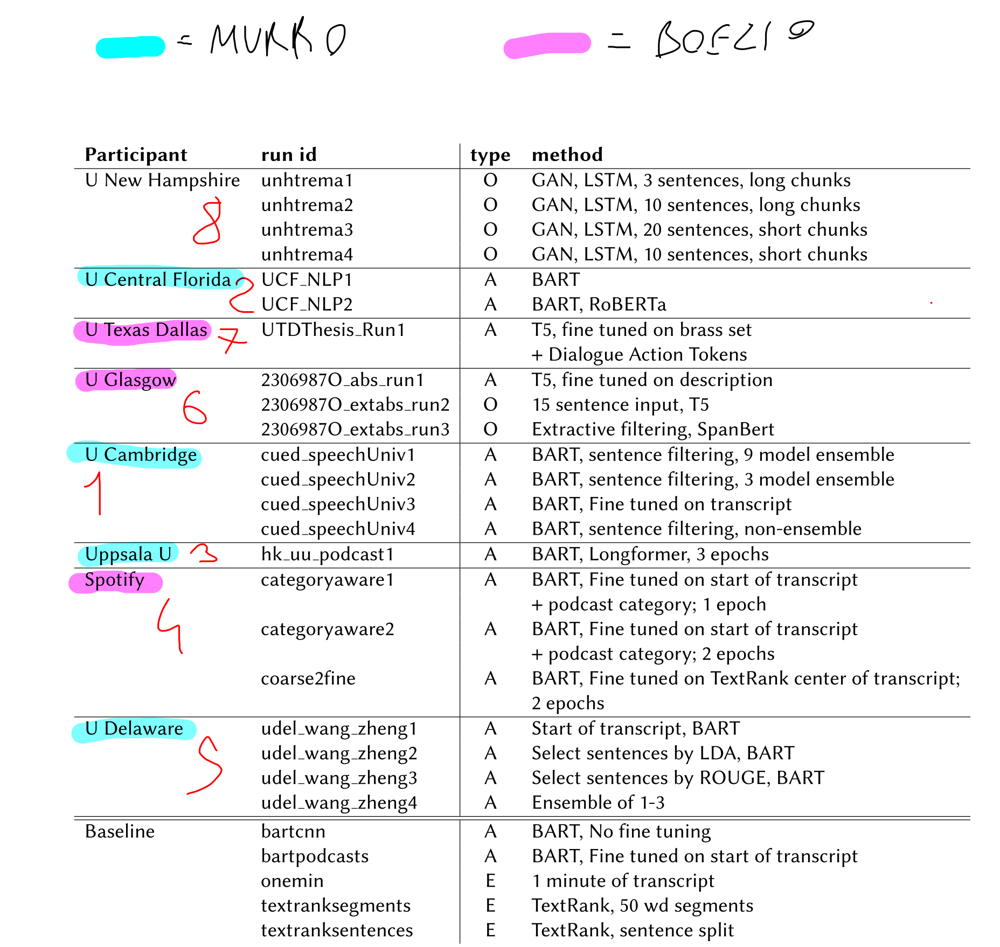
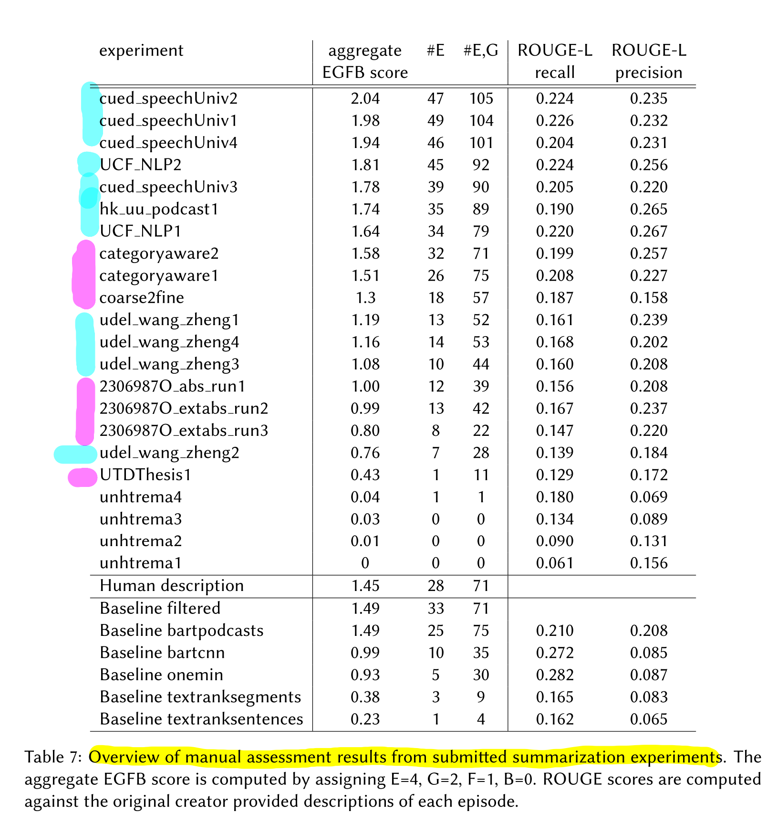

# Notes about papers

- [`dataset_paper.pdf`](./dataset_paper.pdf) describes some useful preprocessing steps and some models like BART used as a baseline by Spotify, so we have to perform better than that!

    - The preprocessing explained removes

    - | Criterion                        | Threshold                                                    |
        | -------------------------------- | ------------------------------------------------------------ |
        | Length                           | descriptions that are very long (> 750 characters) or short (< 20 characters) amounting to 24, 033 or 23% of the descriptions. |
        | Similarity to show description   | descriptions with high lexical overlap (over 40%) with their show description, amounting to 9, 444 or 9% of the descriptions. |
        | Similarity to other descriptions | descriptions with high lexical overlap (over 50%) with other episode descriptions amounting 15, 375 or 15% of the descriptions. |

    - **brass set** is the dataset filtered according to the criterion

    - 4 baselines as summarization model: 

        - Take the first minute from the transcript (naive)
        - TextRank (unsupervised based on PageRank)
        - BART-CNN (pretrained BART from huggingface without finetuning)
        - BART-PODCASTS (BART finetuned over the first 1024 tokens of the transcript)

- [`overview_TREC_2020`](./overview_TREC_2020.pdf): a summary of the results of the TREC 2020 competition
    
    - Best models:
    
      |        Papers         |       Ranking       |
      | :-------------------: | :-----------------: |
      |  |  |
    
- [`5_udel_wang_zheng_A Two-Phase Approach for Abstractive Podcast Summarization`](./papers_partecipants_TREC_2020/5_udel_wang_zheng_A Two-Phase Approach for Abstractive Podcast Summarization.pdf) - selects the important sentences from the transcript in the first phase and uses the encoder-decoder network to generate the abstractive summary based on the selection
  
    - Additional data preprocessing on top of the Brass Set as follows:
        - Remove episodes with profanity language in the episode or show descriptions.
        - Remove episodes with non-English descriptions. 
        - Remove episodes whose description is less than 10 tokens 
        - They perform some data preprocessing for episode description, including using some rule-based methods to remove the social media link and sponsorship
    
- [`3_hk_uu_AbstractivePodcastSummarizationUsingBARTwithLongformerAttention`](./papers_partecipants_TREC_2020/3_hk uu_AbstractivePodcastSummarizationUsingBARTwithLongformerAttention.pdf)- extend  BART model by replacing the attention layers with attention mechanism used in the Longformer 

- [`2_UCF_Automatic Summarization of Open-Domain Podcast Episodes`](./papers_partecipants_TREC_2020/2_UCF_Automatic Summarization of Open-Domain Podcast Episodes.pdf) : identifying important segments from the transcripts to serve as input to BART
    
    - Preproccesing:
        - instead of rely on the **brass subset** (66,242 episodes) try to identify sentences that contain improper content and remove them from the descriptions
            - compute a *salience score* for each sentence of the description by summing over word IDF scores
            - remove sentences if their salience scores are lower than a threshold (σ=10)
            - method results in 79,912 training examples
        - need to have a maximum length of transcription of 1024 token (positional embedding matrix size of BART)
        - use **segment-based extraction** (rather than sentence-based):
            - a segment is corresponds to 30 seconds of audio
            - take 33 segments from the beginning and 7 segments from the end of each transcript to be the candidate segments
            - create a vector of 12 feature scores for a candidate segment (based on TF-IDF score)
            - Each vector is fed to a feedforward and a softmax layer to predict if the segment is salient
            - as target for the training of the classifier, a segment is labelled as positive if the score is greater than a threshold (τ=0.2) otherwise negative
    - Fine-tuning BART-LARGE
    - Summary Postprocessing:
        - length_penalty p=2.0 to not penalize the generation of longer summaries
        - min_length of a summary = 35, max_length = 250, beam size of K=4
        - removing the content after “—”
        - removing URLs
        - removing brackets and the content inside it
        - removing any trailing incomplete sentence if the summary is excessively long
        - removing duplicate sentences that occur three times or more across different episodes
    
- [`1_cued_speech_UCambridge`](./papers_partecipants_TREC_2020/1_cued_speech_UCambridge.pdf): addictional preproccesing wrt the dataset paper and fine-tune the BART model on the Podcast data
    
    - Preproccesing:
        - Start from the **brass subset** (66,242 episodes)
        - filtered out episodes with descriptions shorter than 5 tokens, and process creator-provided descriptions by removing URL links and @name
        - need to have a maximum length of transcription of 1024 token (positional embedding matrix size of BART)
        - use alternative methods by filtering out redundant or less informative sentences in the input transcriptions
            - the best one is **Hierarchical Attention**
    - Splitting: split the data into train/dev sets of 60,415/2,189 episodes
    - Fine-tuning BART
    - Use combined loss inspied by reiforcement learning $\mathcal{L}=\gamma \mathcal{L}_{\mathrm{rl}}+(1-\gamma) \mathcal{L}_{\mathrm{ml}}$ where
        - $\mathcal{L}_{\mathrm{ml}}=-\log P(\mathbf{y} \mid \mathbf{x} ; \boldsymbol{\theta})=-\sum_{t} \log P\left(y_{t} \mid \mathbf{y}_{1: t-1}, \mathbf{x} ; \boldsymbol{\theta}\right)$
        - $\mathcal{L}_{r l}=(\operatorname{Reward}(\tilde{\mathbf{y}})-\operatorname{Reward}(\hat{\mathbf{y}})) \sum_{t} \log P\left(\hat{y}_{t} \mid \hat{\mathbf{y}}_{1: t-1}, \mathbf{x} ; \boldsymbol{\theta}\right)$ where Reward is ROUGE-L
    - the best is an *Ensemble of 9 BART models* (combine 3 random seeds × 3 checkpoints), each trained on filtered transcription (using hierarchical model) data + Lrl criterion (see on the paper the formula to combine predictions of ensemble models)
    - GitHub repository: [https://github.com/potsawee/podcast_trec2020](https://github.com/potsawee/podcast_trec2020)
    
- `Towards Abstractive Grounded Summarization of Podcast Transcripts` 
  
    - GitHub repository: [https://github.com/tencent-ailab/GrndPodcastSum](https://github.com/tencent-ailab/GrndPodcastSum)

### Highlightings meaning

Annotation used for *highlightings* in documents:

- **YELLOW** for important notions in the paper
- **ORANGE** for problems and limitations of the algorithms
- **GREEN** for important conclusions, impressive results or future avenues

### Useful link
- list of presented papers at TREC 2020: [https://trec.nist.gov/pubs/trec29/trec2020.html](https://trec.nist.gov/pubs/trec29/trec2020.html)
- list of presented papers at TREC 2021: [https://trec.nist.gov/pubs/trec30/trec2021.html](https://trec.nist.gov/pubs/trec30/trec2021.html)
